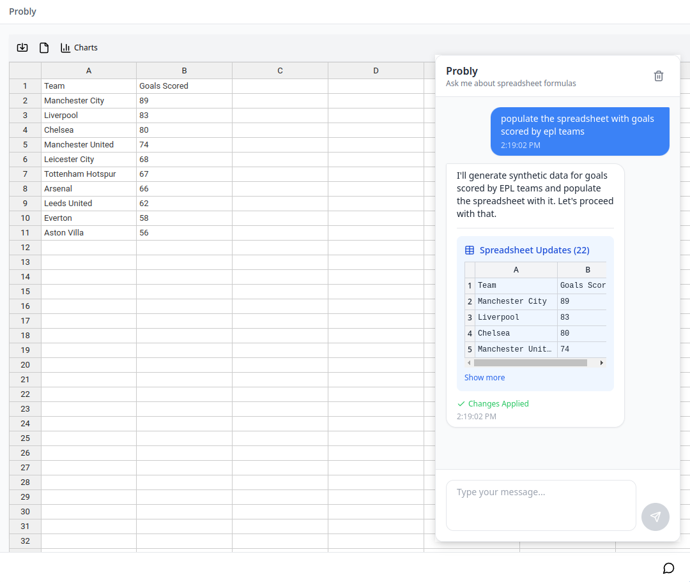

# Probly

An AI-powered spreadsheet application that combines spreadsheet functionality with Python data analysis capabilities.



## Features

- **Interactive Spreadsheet**: Full-featured spreadsheet with formula support
- **Python Analysis**: Run Python code directly in your browser using WebAssembly
- **Data Visualization**: Create charts and visualizations from your data
- **AI-Powered**: Get intelligent suggestions and automated analysis

## Architecture

Probly uses a modern architecture:

- **Frontend**: Next.js application that runs in the browser
- **Python Execution**: Pyodide (Python compiled to WebAssembly) runs entirely in the browser
- **LLM Integration**: OpenAI API calls are proxied through the server

This design means that data analysis happens locally in your browser, providing better performance and privacy.

## Requirements

- Node.js 18 or higher
- npm or yarn
- A modern web browser (Chrome, Firefox, Edge, or Safari)
- OpenAI API key

## Quick Start with Docker

The easiest way to get started with Probly is using Docker:

1. Clone the repository:
   ```bash
   git clone https://github.com/PragmaticMachineLearning/probly.git
   cd probly
   ```

2. Create a simple `.env` file with your OpenAI API key:
   ```
   OPENAI_API_KEY=your_api_key_here
   ```

3. Build and start the application:
   ```bash
   docker compose build
   docker compose up -d
   ```

4. Access Probly at http://localhost:3000

The Docker container serves the Next.js application and handles API requests to OpenAI, while all Python code execution happens in your browser using WebAssembly.

## Manual Installation

If you prefer to run Probly without Docker:

1. Clone the repository
   ```bash
   git clone https://github.com/PragmaticMachineLearning/probly.git
   cd probly
   ```

2. Install dependencies:
   ```bash
   npm install
   ```

3. Create a `.env` file with your OpenAI API key:
   ```
   OPENAI_API_KEY=your_api_key_here
   ```

4. Start the development server:
   ```bash
   npm run dev
   ```

5. For production, build and start:
   ```bash
   npm run build
   npm start
   ```

## Using Probly

1. Start the application and open it in your browser
2. Import data using the import button or start with a blank spreadsheet
3. Open the AI chat with the keyboard shortcut:
   - **Windows/Linux**: `Ctrl+Shift+?`
   - **Mac**: `⌘+Shift+?` (Command+Shift+?)
4. Ask questions about your data or request analysis

## Keyboard Shortcuts

| Action | Windows/Linux | Mac |
|--------|--------------|-----|
| Toggle AI Chat | `Ctrl+Shift+?` | `⌘+Shift+?` (Command+Shift+?) |

## Advanced Docker Options

### Alternative Docker Setup

You can also pass the API key directly to Docker Compose:

```bash
OPENAI_API_KEY=your_api_key_here docker compose build
OPENAI_API_KEY=your_api_key_here docker compose up -d
```

### Building Custom Docker Images

To build a custom Docker image with your API key baked in:

```bash
docker build -t probly:custom --build-arg OPENAI_API_KEY=your_api_key_here .
docker run -p 3000:3000 probly:custom
```

## Tech Stack

- **Frontend**: Next.js 14, TypeScript, React
- **Spreadsheet**: Handsontable, HyperFormula
- **Python Runtime**: Pyodide (WebAssembly)
- **LLM**: OpenAI API
- **Visualization**: ECharts

## Documentation

For comprehensive documentation, visit the [Probly Documentation](https://probly-ai.readthedocs.io/en/latest/).

## License

[MIT License](LICENSE)
